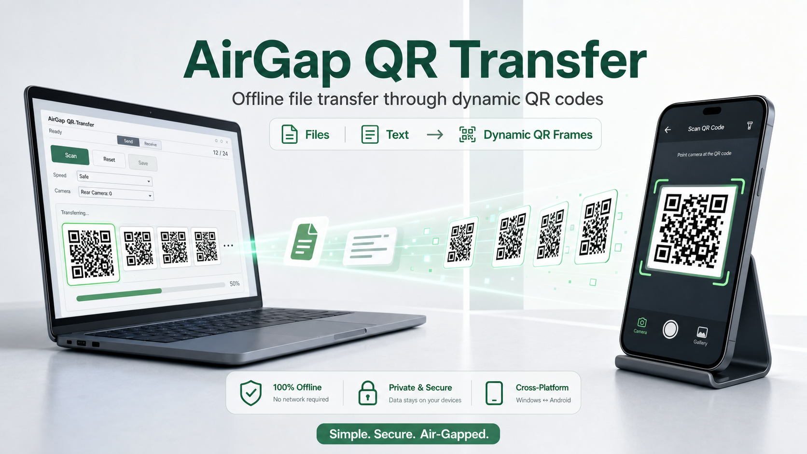

# AirGap QR Transfer



AirGap QR Transfer 是一个基于动态二维码的跨平台离线文件摆渡系统。它面向物理隔离环境：发送端在屏幕上连续播放二维码帧，接收端用摄像头连续扫描、去重、重组并校验文件，从而在没有网络、U 盘、光盘、蓝牙或 Wi-Fi 的情况下完成文件或纯文本传递。

> Status: MVP prototype. Windows and Android debug builds are available, core protocol tests are in place, and small-file end-to-end smoke tests have passed in both Windows -> Android and Android -> Windows directions.

## Features

- Windows + Android cross-platform app built with Qt 6, QML and C++20.
- One-way dynamic QR transfer loop: `manifest -> data chunks -> end`.
- File transfer and plain-text transfer.
- Receiver-side chunk deduplication and missing-frame feedback QR for resend loops.
- SHA-256 verification before a received file is considered complete.
- Session isolation with `session_id` and file identity with `file_id`.
- Camera selection on desktop receive mode.
- Android save flow through the system file picker.
- QR encoder/decoder behind adapter interfaces, currently using `libqrencode` and `ZXing-C++`.
- No network, telemetry, cloud sync, update check or crash upload code.

## Non-Goals

The first MVP intentionally does not implement:

- Network transfer.
- Bluetooth transfer.
- Wi-Fi or Wi-Fi Direct transfer.
- USB drive import/export workflows.
- Multi-file batch transfer.
- Bidirectional ACK over QR during normal playback.

## Project Layout

```text
src/core   Protocol frames, chunking, CRC32, SHA-256, session and reassembly logic
src/qr     QR encoder/decoder adapter layer
src/app    Qt/QML application, send/receive controllers and platform glue
tests      Core, QR and app-level unit tests
docs       Architecture, protocol, testing and MVP planning notes
scripts    Local smoke-test, Android and packaging helpers
```

## Current Status

Implemented and tested:

- Core manifest/data/end frame codec.
- CRC32 frame validation and SHA-256 file validation.
- Fixed-size chunk planning and frame generation.
- Receive-side deduplication, conflict detection, reassembly and hash checking.
- Real QR encode/decode adapters.
- Qt/QML send and receive UI.
- Android camera permission handling.
- Android QR-enabled arm64 debug APK build.
- Windows packaging script for a Windows 10 x64 deployment zip.
- Manual feedback/resend flow for missing chunks.
- Small-file smoke tests:
  - Windows -> Android.
  - Android -> Windows.

Known gaps:

- Windows -> Windows and Android -> Android still need more real-device acceptance testing.
- Large transfers still need performance tuning and long-run stability testing.
- A project license has not been selected yet. Add `LICENSE` before treating this as a fully licensed open-source release.

## Requirements

General:

- CMake 3.20 or newer.
- C++20 compiler.
- vcpkg for `libqrencode` and `nu-book-zxing-cpp`.

Windows desktop build:

- Windows 10 or newer.
- Visual Studio 2022 Build Tools or a compatible MSVC toolchain.
- Qt 6.8.3 MSVC 2022 x64 with `qtmultimedia`.

Android build:

- JDK 17.
- Android SDK platform 33.
- Android build-tools 33.0.2.
- Android NDK 27.2.12479018.
- Qt 6.5.3 Android arm64-v8a kit with `qtmultimedia`.
- Qt host tools, currently verified with Qt 6.5.3 MSVC 2019 x64.

## Build And Test On Windows

Open a Visual Studio 2022 developer environment, then build the core libraries and tests:

```powershell
cmd /c "call ""C:\Program Files (x86)\Microsoft Visual Studio\2022\BuildTools\Common7\Tools\VsDevCmd.bat"" -arch=x64 && cmake -S . -B build-nmake -G ""NMake Makefiles"" && cmake --build build-nmake && ctest --test-dir build-nmake --output-on-failure"
```

Build with vcpkg-backed real QR adapters:

```powershell
cmd /c "call ""C:\Program Files (x86)\Microsoft Visual Studio\2022\BuildTools\Common7\Tools\VsDevCmd.bat"" -arch=x64 && cmake -S . -B build-vcpkg-nmake -G ""NMake Makefiles"" -DCMAKE_TOOLCHAIN_FILE=""C:\Program Files (x86)\Microsoft Visual Studio\2022\BuildTools\VC\vcpkg\scripts\buildsystems\vcpkg.cmake"" -DVCPKG_TARGET_TRIPLET=x64-windows && cmake --build build-vcpkg-nmake && ctest --test-dir build-vcpkg-nmake --output-on-failure"
```

Build the Qt desktop app with the verified local Qt path:

```powershell
cmd /c "call ""C:\Program Files (x86)\Microsoft Visual Studio\2022\BuildTools\Common7\Tools\VsDevCmd.bat"" -arch=x64 && cmake -S . -B build-qt-release-nmake -G ""NMake Makefiles"" -DCMAKE_BUILD_TYPE=Release -DCMAKE_TOOLCHAIN_FILE=""C:\Program Files (x86)\Microsoft Visual Studio\2022\BuildTools\VC\vcpkg\scripts\buildsystems\vcpkg.cmake"" -DVCPKG_TARGET_TRIPLET=x64-windows -DCMAKE_PREFIX_PATH=""C:\Qt\6.8.3\msvc2022_64"" && cmake --build build-qt-release-nmake && ctest --test-dir build-qt-release-nmake --output-on-failure"
```

Package a Windows 10 x64 deployment zip:

```powershell
powershell -ExecutionPolicy Bypass -File .\scripts\package-windows.ps1
```

The packaged output is written to:

```text
dist\AirGapQRTransfer-Windows10-x64.zip
```

## Build Android APK

If using Qt 6.5.3 Android Multimedia on devices that hit the Camera2 `maxImages has already been acquired` issue, apply the local patch first:

```powershell
powershell -ExecutionPolicy Bypass -File .\scripts\patch-qt-android-camera2.ps1
```

Install Android QR dependencies with vcpkg:

```powershell
$env:ANDROID_NDK_HOME = "C:\Android\Sdk\ndk\27.2.12479018"
$env:ANDROID_NDK_ROOT = "C:\Android\Sdk\ndk\27.2.12479018"
$env:ANDROID_SDK_ROOT = "C:\Android\Sdk"
& "C:\Program Files (x86)\Microsoft Visual Studio\2022\BuildTools\VC\vcpkg\vcpkg.exe" install --triplet arm64-android --x-install-root=build-vcpkg-android\vcpkg_installed
```

Configure and build the QR-enabled Android debug APK:

```powershell
$ninja = Get-ChildItem $env:LOCALAPPDATA\Microsoft\WinGet\Packages -Recurse -Filter ninja.exe | Select-Object -First 1 -ExpandProperty FullName
$env:JAVA_HOME = "C:\Program Files\Eclipse Adoptium\jdk-17.0.19.10-hotspot"
$env:ANDROID_SDK_ROOT = "C:\Android\Sdk"
$env:ANDROID_HOME = "C:\Android\Sdk"
$env:ANDROID_NDK_ROOT = "C:\Android\Sdk\ndk\27.2.12479018"
$env:ANDROID_NDK_HOME = "C:\Android\Sdk\ndk\27.2.12479018"
$env:Path = "$env:JAVA_HOME\bin;$env:ANDROID_SDK_ROOT\cmdline-tools\latest\bin;$env:ANDROID_SDK_ROOT\platform-tools;$(Split-Path $ninja);$env:Path"

cmake -S . -B build-android-qr-arm64 -G Ninja `
  -DCMAKE_MAKE_PROGRAM="$ninja" `
  -DCMAKE_BUILD_TYPE=Debug `
  -DCMAKE_TOOLCHAIN_FILE="C:\Qt\6.5.3\android_arm64_v8a\lib\cmake\Qt6\qt.toolchain.cmake" `
  -DCMAKE_PREFIX_PATH="C:\Qt\6.5.3\android_arm64_v8a" `
  -DQT_HOST_PATH="C:\Qt\6.5.3\msvc2019_64" `
  -DANDROID_SDK_ROOT="C:\Android\Sdk" `
  -DANDROID_NDK_ROOT="C:\Android\Sdk\ndk\27.2.12479018" `
  -DANDROID_ABI=arm64-v8a `
  -DANDROID_PLATFORM=android-33 `
  -DAIRGAP_QR_DEP_ROOT="C:\Users\weien\Documents\qr-transfer\build-vcpkg-android\vcpkg_installed\arm64-android" `
  -DBUILD_TESTING=OFF

cmake --build build-android-qr-arm64
```

APK output:

```text
build-android-qr-arm64\src\app\android-build\build\outputs\apk\debug\android-build-debug.apk
```

Check APK permissions:

```powershell
& "C:\Android\Sdk\build-tools\33.0.2\aapt.exe" dump permissions "build-android-qr-arm64\src\app\android-build\build\outputs\apk\debug\android-build-debug.apk"
```

Expected permission:

```text
uses-permission: name='android.permission.CAMERA'
```

## Smoke Tests

Install and start the Android APK:

```powershell
powershell -ExecutionPolicy Bypass -File .\scripts\android-smoke.ps1 -GrantCamera
```

Start a Windows sender with a generated sample file:

```powershell
powershell -ExecutionPolicy Bypass -File .\scripts\windows-sender-smoke.ps1
```

Start a Windows receiver with a selected camera:

```powershell
powershell -ExecutionPolicy Bypass -File .\scripts\windows-receiver-smoke.ps1 -CameraIndex <index>
```

Pull an Android private-directory received sample for hash comparison:

```powershell
powershell -ExecutionPolicy Bypass -File .\scripts\android-pull-received.ps1 -SourcePath .\build\manual-e2e\airgap-e2e-sample.txt
```

## Desktop Launch Options

```text
--send-file <path>  Prepare a local file on startup
--send-text <text>  Prepare UTF-8 text on startup
--play              Start playback after preparing send content
--fullscreen        Start in full-screen mode
--receive           Start on the Receive tab
--scan              Start scanning after Receive view is ready
--camera-index <n>  Select receive camera by zero-based index
--save-dir <path>   Auto-save verified receive output to a directory
--status-file <p>   Write receive diagnostics to a status file
```

## Security Model

AirGap QR Transfer is designed for offline environments. The application should not initiate network access. The Android manifest is expected to declare camera permission only.

Protocol and file-handling rules:

- Every transfer session has a `session_id`.
- Every frame includes a protocol version.
- Each frame is protected by CRC32.
- The reconstructed file is accepted only after SHA-256 matches the manifest.
- External filenames and manifest fields are treated as untrusted input.
- Parser functions must reject malformed input without crashing.

See [docs/protocol.md](docs/protocol.md) for the frame format.

## Documentation

- [Architecture](docs/architecture.md)
- [Protocol](docs/protocol.md)
- [MVP plan](docs/mvp-plan.md)
- [Manual feedback resend](docs/manual-feedback-resend.md)
- [Testing](docs/testing.md)

## Roadmap

- Stabilize Android sender/receiver camera behavior across more devices.
- Improve high-frame-count transfer speed and resend efficiency.
- Add broader Windows -> Windows and Android -> Android acceptance tests.
- Add release packaging notes and reproducible release checklist.
- Select and add an open-source license.
- Add CI once the dependency and Qt installation strategy is settled.

## Contributing

Contributions are welcome after the repository license is selected. For now, please keep changes small and aligned with [AGENTS.md](AGENTS.md):

- Keep the protocol core independent from QML and UI code.
- Add or update tests for protocol and parsing changes.
- Do not add networking, telemetry, cloud sync or remote logging.
- Update documentation when protocol or build behavior changes.
- Report build and test results with every change.

## License

No open-source license has been selected yet. Until a `LICENSE` file is added, all rights remain with the copyright holder by default, even though the repository is public.
